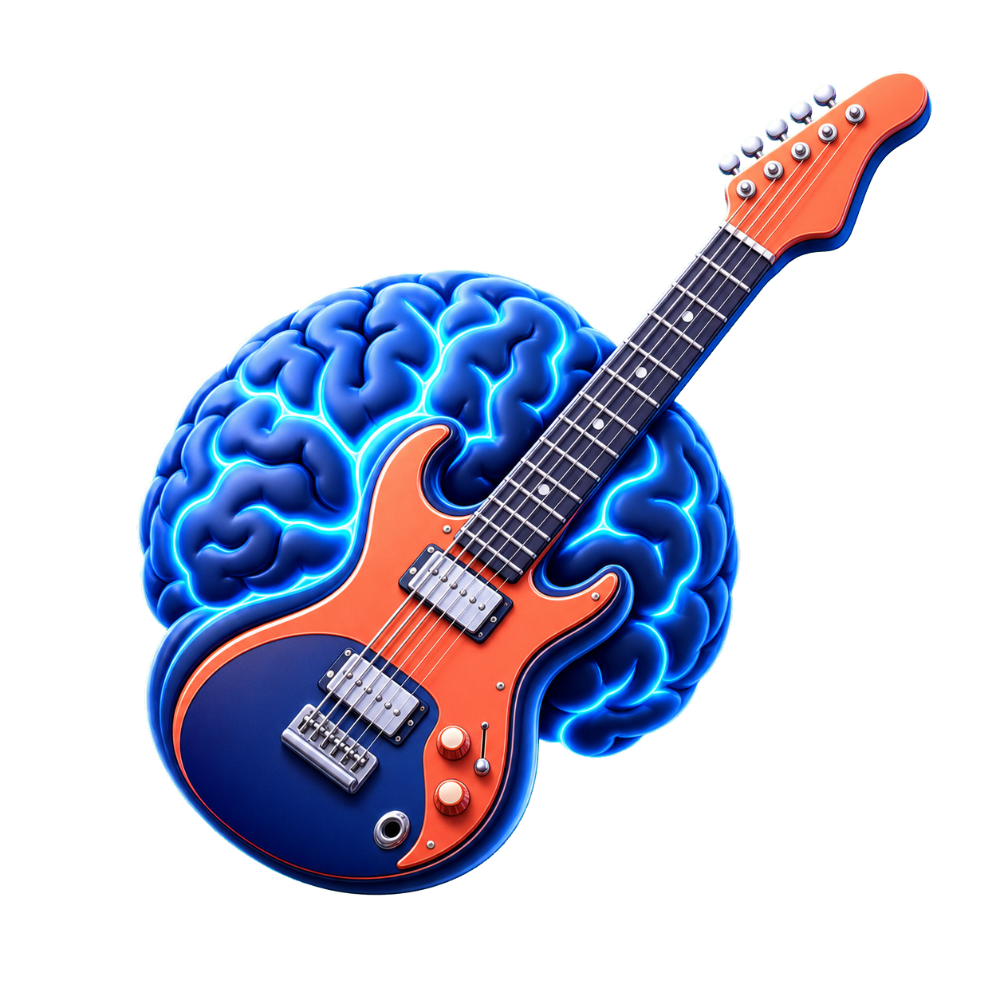

# AI Band Practice Tool

A professional macOS desktop application for musicians to load audio files, separate them into instrument stems using AI, and perform real-time mixing with volume, mute, and solo controls.

**Current version: 1.1.0**



**Features:**
- ✅ Load audio files (WAV, MP3, FLAC, OGG, M4A)
- ✅ AI-powered stem separation (vocals, drums, bass, other)
- ✅ Real-time mixing controls (volume, mute, solo)
- ✅ Intelligent caching (no reprocessing)
- ✅ Low-latency playback
- ✅ Offline tempo and pitch practice transforms
- ✅ Cached song rename, delete, and stem export with descriptive filenames
- ✅ Embedded title, artist, duration, and BPM metadata in the library
- ✅ Filename cleanup and artist/title inference when tags are missing
- ✅ Background BPM analysis cached per song
- ✅ Shared playback controls in Mixer and Lyrics/Chords
- ✅ Click-to-seek and handle dragging in both playback timelines
- ✅ Lyrics/chords notes saved per processed song
- ✅ Automatic synced lyric transcription when faster-whisper is installed
- ✅ Approximate synced chord detection for guitar practice
- ✅ Optional AI lyric interpretation with OpenAI API
- ✅ Dark theme UI optimized for musicians
- ✅ Apple Silicon native support (M1/M2/M3)

## What's New in 1.1.0

- Fixed cached-stem export, including validation, feedback, and clear output filenames.
- Added a complete playback section to **Letra y acordes**, synchronized with Mixer through the same global player.
- Added click-to-seek while preserving traditional timeline dragging.
- Improved Biblioteca metadata using embedded tags, filename inference, real duration, and cached BPM analysis.
- Removed duplicated playback and current-chord elements from the lyrics view.

## System Requirements

- **OS**: macOS 11.0+ (Apple Silicon native)
- **Python**: 3.11-3.13 recommended. Python 3.14 can work when compatible PyTorch wheels are available.
- **RAM**: 8GB minimum (16GB recommended for separation)
- **Storage**: 500MB for dependencies + cache

## Installation

### 1. Clone Repository

```bash
git clone <repo-url> Splitter-IA
cd Splitter-IA
```

### 2. Create Virtual Environment

```bash
python3 -m venv venv
source venv/bin/activate
```

### 3. Install Dependencies

```bash
pip install --upgrade pip
pip install -r requirements.txt
```

**Note**: First-time installation will download PyTorch (~2GB) and the Demucs model (~300MB). If PyTorch install fails, use Python 3.11 or 3.12 and reinstall the virtual environment.

### Optional Local Lyric Transcription

Automatic synced lyrics use local Whisper through `faster-whisper`:

```bash
source venv/bin/activate
pip install faster-whisper
```

The default transcription model is `small` for better Spanish results. You can choose another model with:

```bash
export WHISPER_MODEL=base
python main.py
```

### 4. Verify Installation

```bash
python -c "import torch; print(f'PyTorch: {torch.__version__}'); print(f'MPS Available: {torch.backends.mps.is_available()}')"
python -c "import demucs; print(f'Demucs OK')"
```

## Usage

### Running the Application

```bash
# Activate virtual environment
source venv/bin/activate

# Run the app
python main.py
```

### Workflow

The app is split into three main tabs:

- **Biblioteca**: gestionar canciones procesadas, metadata, búsqueda, carga, renombrado, exportación y eliminación.
- **Mixer**: controlar stems, volumen, mute/solo, tempo, pitch y reproducción.
- **Letra y acordes**: seguir letra y acordes sincronizados usando el mismo reproductor global del Mixer.

1. **Cargar canción en Biblioteca**
   - Click **Abrir canción** o arrastrá un archivo
   - Soporta WAV, MP3, FLAC, OGG, M4A
   - La tabla muestra canción, artista, duración y BPM
   - Se priorizan los tags embebidos; si faltan, se infieren artista y título desde el filename
   - El BPM faltante se calcula en background una sola vez y queda cacheado

2. **Separar pistas en Biblioteca**
   - Click **Separar pistas**
   - La separación puede tardar 30-60 segundos según la canción
   - La primera separación descarga el modelo de Demucs (~300MB)
   - Los resultados quedan cacheados automáticamente

3. **Mezclar y reproducir en Mixer**
   - Sliders de volumen por pista: 0-100%
   - **Mute**: silencia una pista
   - **Solo**: reproduce solo la pista seleccionada
   - Volumen master
   - Botones Play/Pause/Stop con timeline
   - Click directo sobre cualquier punto del timeline para hacer seek

4. **Herramientas de audio en Mixer**
   - Ajustá Tempo y Pitch con sliders verticales
   - Click **Aplicar FX** para renderizar los cambios
   - Click **Restablecer FX** para volver a los stems separados originales

5. **Letra y acordes**
   - Muestra acorde actual, siguiente acorde, línea actual y próxima línea
   - Los acordes se generan automáticamente cuando se carga una canción procesada
   - Si la letra no está en cache, elegí idioma y tocá **Procesar letra**
   - Incluye Play/Pause/Stop, timeline y volumen master sincronizados con Mixer
   - Cambiar de pestaña no interrumpe la reproducción
   - Los paneles manuales/debug están ocultos en la UI principal

6. **Letra sincronizada**
   - Cargá una canción procesada desde **Biblioteca**
   - Si ya hay letra en cache, se carga automáticamente
   - Si no hay letra, elegí idioma en **Letra y acordes**: Auto, Español, Inglés, Portugués, Francés, Italiano
   - Tocá **Procesar letra** para transcribir con ese idioma
   - Si querés corregir una transcripción existente, cambiá el idioma y tocá **Reprocesar letra**
   - La app prefiere `vocals.wav` de Demucs y usa el audio original como fallback
   - La línea actual se actualiza durante la reproducción con resaltado por palabra cuando hay timestamps

7. **Acordes sincronizados**
   - La app analiza acordes automáticamente cuando no están en cache
   - La app prefiere stems instrumentales y evita la voz cuando es posible
   - El acorde actual y el siguiente se actualizan durante la reproducción
   - Los timestamps/confidence técnicos quedan internos y ocultos en la UI principal

8. **Exportar stems**
   - Seleccioná una canción de Biblioteca o cargá una canción procesada
   - Tocá **Exportar pistas** y elegí una carpeta
   - La app copia directamente los stems cacheados, sin reprocesar audio
   - Los archivos se nombran `Cancion_drums.wav`, `Cancion_vocals.wav`, `Cancion_bass.wav` y `Cancion_other.wav`

### Optional AI Analysis

```bash
export OPENAI_API_KEY="your_api_key_here"
python main.py
```

Or create a local `.env` file in the project:

```bash
cp .env.example .env
# edit .env and paste your API key
```

The app uses the OpenAI Responses API when configured. Without an API key, lyrics and chords still work as a local notebook.

### Keyboard Shortcuts

- `Space`: Play/Pause
- `Esc`: Stop playback
- Double-click marker: Jump to marker

## Folder Structure

```
Splitter-IA/
├── main.py                      # Entry point
├── requirements.txt             # Python dependencies
├── build.spec                   # PyInstaller config
├── src/
│   ├── ui/
│   │   ├── main_window.py       # Main UI window
│   │   ├── widgets.py           # Custom controls
│   │   └── styles.py            # Dark theme
│   ├── audio/
│   │   ├── loader.py            # Audio file loading
│   │   ├── metadata.py          # Tags, filename cleanup, duration and BPM
│   │   ├── player.py            # Playback engine
│   │   └── mixer.py             # Volume/mute/solo logic
│   ├── ai/
│   │   └── demucs_handler.py    # Demucs integration
│   ├── cache/
│   │   └── cache_manager.py     # Caching system
│   └── utils/
│       ├── config.py            # Configuration
│       ├── logger.py            # Logging
│       └── file_hasher.py       # MD5/SHA256 hashing
└── README.md                    # This file
```

## Cache System

Stems are cached automatically in:
```
~/Music/AIStemsCache/{file_hash}/stems/
```

If macOS sandboxing or permissions block `~/Music`, the app falls back to a local project cache at:
```
./cache/{file_hash}/stems/
```

**Benefits:**
- Second load is instant (no reprocessing)
- Cache size typically 200-500MB per song
- Rename, delete, and export cached stems from the Biblioteca panel
- Library metadata and analyzed BPM are persisted in `metadata.json`
- Synced automatic lyrics are saved in `lyrics_segments.json`
- Synced approximate chords are saved in `chord_segments.json`

## Building macOS App Bundle

### 1. Install PyInstaller

```bash
pip install pyinstaller
```

### 2. Build App

```bash
pyinstaller build.spec
```

### 3. Locate App

```bash
open dist/AIStemSeparator.app
```

### 4. Distribution

The .app bundle is fully relocatable. To share:
- Compress: `zip -r AIStemSeparator.zip dist/AIStemSeparator.app`
- Share or distribute via installer

## Performance Tips

1. **First Run**: Model download (~300MB) on first separation - this is one-time only
2. **Processing Time**: Depends on song length and CPU
   - 3-minute song: ~45 seconds on M1
3. **Memory**: Separation uses ~6GB RAM temporarily
4. **Cache**: Enable fast reloading of previously separated songs

## Technical Details

### Audio Engine
- **Loader**: librosa (handles all formats)
- **Player**: sounddevice (low-latency streaming)
- **Format**: 44.1kHz, 2-channel WAV (internal)

### AI Model
- **Demucs**: State-of-the-art stem separation
- **Device**: Auto-detects (Apple Silicon MPS preferred)
- **Stems**: vocals, drums, bass, other

### Threading
- Separation runs in background thread (UI responsive)
- Playback in dedicated audio thread (low-latency)
- Missing library metadata/BPM is resolved in a background thread and cached

## Troubleshooting

### "Module not found" error
```bash
# Reinstall dependencies
source venv/bin/activate
pip install -r requirements.txt --force-reinstall
```

### Playback is silent
- Check Master volume slider
- Verify system audio output in macOS settings
- Check that stems loaded properly (UI should show stem controls)

### Separation crashes or runs out of memory
- Close other applications
- Demucs requires ~6GB RAM for processing
- Try with smaller audio file first

### Model download fails
```bash
# Clear PyTorch cache and retry
rm -rf ~/.cache/torch/
python main.py  # Will re-download model
```

## Development

### Running Tests

```bash
python -m unittest discover -v
```

The suite covers cache/export behavior, metadata cleanup, clickable seek, shared playback state, and synchronized lyrics/chords helpers.

### Code Structure

- **Modular**: Each component (audio, ai, cache, ui) is independent
- **Threaded**: Separation and playback don't block UI
- **Cached**: Intelligent file hashing prevents reprocessing
- **Logged**: All operations logged to `~/Music/AIStemsCache/logs/app.log`

## Future Enhancements

- [ ] Export a rendered master mix
- [ ] Effect presets (acapella, instrumental, etc.)
- [ ] Equalizer controls
- [ ] Batch processing

## License

MIT License - See LICENSE file

## Support

For issues, feature requests, or feedback:
- Create an issue on GitHub
- Include macOS version, Python version, and error logs

## Credits

Built with:
- **PyQt6**: Modern cross-platform UI
- **Demucs**: AI stem separation
- **librosa**: Audio processing
- **Mutagen**: Embedded audio metadata
- **PyTorch**: Deep learning framework
- **sounddevice**: Low-latency audio I/O

---

**Made for musicians, by engineers** 🎵
